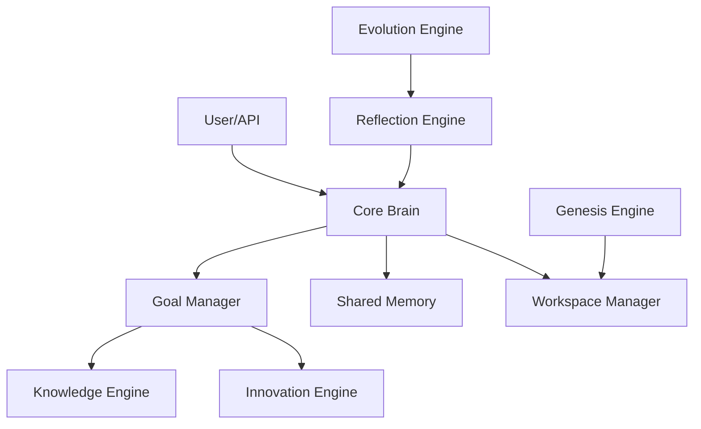

# AETHER 2.0: System Architecture

AETHER 2.0 is an Advanced Agentic AI Operating System designed to run cognitive loops, manage environments, and orchestrate autonomous execution.

## Engines
1. **Core Brain**: The central executive that routes intents, schedules tasks, and handles central cognition.
2. **Goal Manager**: Decomposes user intents into structured execution task trees.
3. **Workspace Manager**: Manages sandboxed directories and code environments.
4. **Shared Memory**: Multi-tier context storage (working memory, episodic, long-term).
5. **Knowledge Engine**: RAG capabilities, semantic searches, and document indexing.
6. **Innovation Engine**: Brainstorms alternate execution strategies when plans fail.
7. **Genesis Engine**: Compiles and spawns dynamic sub-agents for specialized tasks.
8. **Reflection Engine**: Performs self-critique on task execution outcomes.
9. **Evolution Engine**: Adjusts prompts and hyperparameters recursively based on reflection logs.
